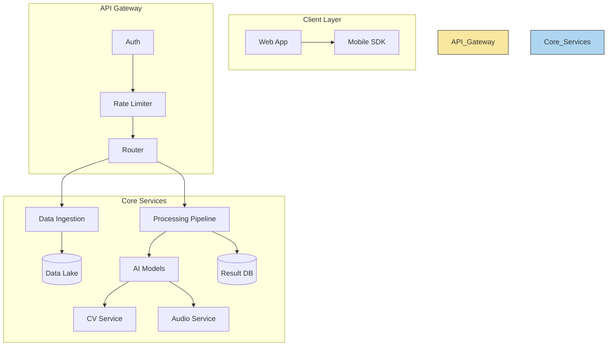
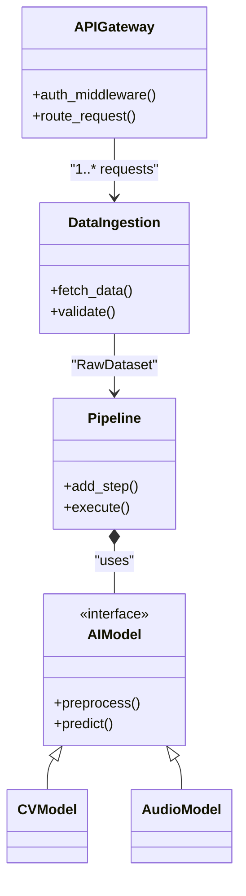
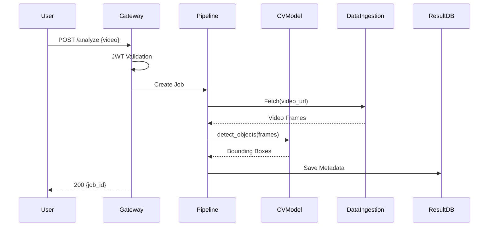

# Data Meets Intelligence
A Next-Gen Multimodal AI Platform for Smart Data Processing

🚀 Seamlessly unify image, video, and audio data pipelines with AI-powered automation.
## 🔧 Features:

- Unified API for cross-modal data fusion (CV/NLP/ASR)

- Auto-optimized preprocessing & feature extraction

- Scalable deployment (cloud/edge) with PyTorch/TensorFlow backends

- Real-time analytics dashboard for multimodal insights
## 💡 Use Cases:
- ✔️ Media analysis & content moderation
- ✔️ IoT sensor fusion & smart surveillance
- ✔️ Generative AI training data prep

---

## 🏗️ Architecture
### Component Diagram

## 🧠 Core Design
### Class Diagram

## ⚡️ API Workflow
### Sequence Diagram
